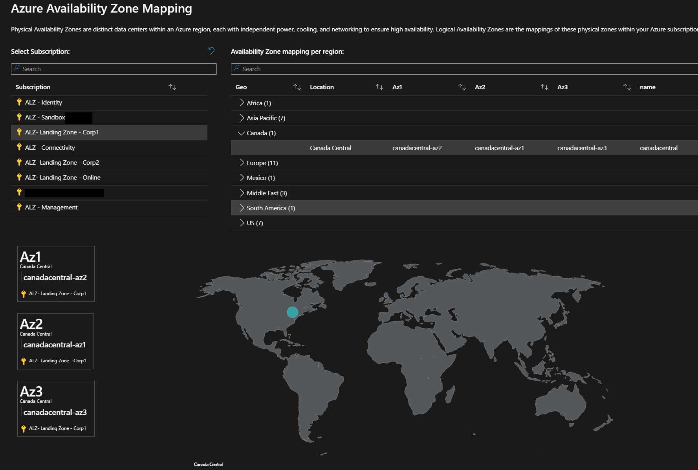

# Azure-AzMappingWorkbook

With this workbook you can map the Logical Azure Availability Zones to the Physical Azure Availability Zones. This workbook is based on the information provided by Microsoft in the [Azure documentation](https://docs.microsoft.com/en-us/azure/availability-zones/az-overview). 

## How to use this workbook

1. Deploy the workbook to Azure.
2. Open the workbook.
3. Select a Subscription you want to know the Azure Availability Zones mapping for.
4. Select the Region you want to know the Azure Availability Zones mapping for.
5. The workbook will show you the mapping of the Logical Azure Availability Zones to the Physical Azure Availability Zones.
6. (optional) Export results to Excel.

## example screenshot

